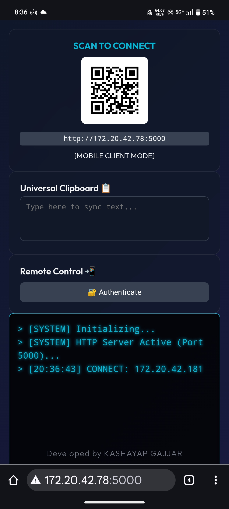
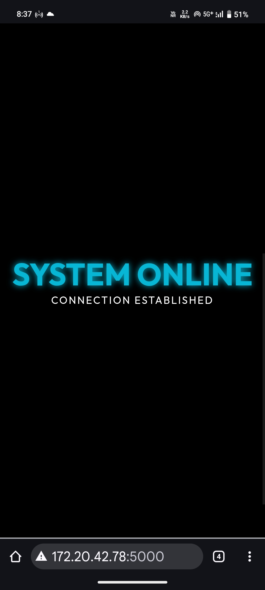

Here is a professional, "Hacker-Style" **README.md** file for your GitHub repository.

It highlights all the advanced features you built (Matrix Log, Remote Control, Clipboard) and provides clear instructions for anyone who wants to use it.

-----

### 📝 **How to use this:**

1.  Create a file named **`README.md`** in your project folder.
2.  Paste the text below into it.
3.  Run `git add README.md`, `git commit -m "Add documentation"`, and `git push`.

-----

# 📂 LAN-FILE-TUNNEL (Silent Count)

> **A high-speed, local HTTP file transfer system with remote command capabilities.** \> *Transfer files, sync clipboards, and control your PC from any device on your Wi-Fi—no internet required.*

## ⚡ Features

### 🚀 Core Functionality

  * **High-Speed Transfer:** Transfer files directly over LAN (Wi-Fi) without using mobile data.
  * **Cross-Platform:** Works on Android, iOS, Windows, Linux, and MacOS via any web browser.
  * **Batch Uploads:** Upload single files or entire folders with a progress bar.
  * **Instant Download:** Download files individually or zip the entire server storage on the fly.

### 🛡️ "Cyber" Utilities

  * **Matrix Traffic Monitor:** A live, scrolling terminal log on the web interface showing all server activity (IPs, Uploads, Requests).
  * **Remote Command Center:**
      * 🔒 **Lock PC:** Instantly lock the host computer from your phone.
      * 🛑 **Shutdown:** Remotely shut down the host server.
      * 🔔 **Ping:** Send a signal to locate connected devices.
  * **Universal Clipboard:** A real-time synchronized text box. Copy text on your PC, paste it on your phone instantly.
  * **QR Code Connect:** Auto-generates a QR code for instant mobile connection.

-----

## 🛠️ Installation

### Prerequisites

  * Python 3.x installed.
  * A Windows PC (for Remote Control features) *[Optional - works on Linux without Remote Lock]*.

### 1\. Clone the Repository

```bash
git clone https://github.com/YOUR_USERNAME/LAN-FILE-TUNNEL.git
cd LAN-FILE-TUNNEL
```

### 2\. Install Dependencies

Run the following command to install the required libraries:

```bash
pip install flask flask-socketio eventlet user-agents qrcode pillow
```

-----

## 💻 Usage

### Quick Start (Windows)

Double-click the **`run_app.bat`** file.  
This will automatically:

1.  Kill any old instances of the server.
2.  Start the Python server.
3.  Open the Admin Dashboard in your default browser.
4.  **Pro Tip:** For frequent use, set a **Static IP** on your PC to keep the QR code address the same every day.

### Manual Start (Terminal)

```bash
python app.py
```

## 🖥️ Screenshots

### 💻 PC / Admin Dashboard
| Main Interface | File Transfer | Matrix Log |
|:---:|:---:|:---:|
| .png) | .png) | .png) |

### 📱 Mobile Interface
| Mobile Upload | Remote Control |
|:---:|:---:|
|  |  |

### Connecting Devices

1.  Ensure your Phone and PC are on the **same Wi-Fi network**.
2.  Open the Admin Dashboard on your PC.
3.  **Scan the QR Code** displayed on the sidebar with your phone.
4.  *Alternatively:* Type the IP address shown (e.g., `http://192.168.1.5:5000`) into your mobile browser.

-----

## 🖥️ Screenshots

| **Admin Dashboard** | **Mobile Interface** |
|:---:|:---:|
| *Matrix-style log, File Manager, and QR Code* | *Simple Upload/Download & Remote Controls* |

*(You can add actual screenshots here later)*

-----

## ⚙️ Configuration

You can adjust settings in `app.py`:

```python
# Change the Upload Folder Name
app.config['UPLOAD_FOLDER'] = 'my_files'

# Change Max File Size (Default: 16GB)
app.config['MAX_CONTENT_LENGTH'] = 16 * 1024 * 1024 * 1024
```

-----

## ⚠️ Disclaimer

This tool uses **HTTP** for maximum speed and compatibility. It is designed for **Home/Private Wi-Fi** use.

  * **Do not** use this on public Wi-Fi (like airports or cafes) as data is not encrypted.
  * **Remote Shutdown** is powerful—ensure only trusted devices have access.

-----

## 🤝 Contributing

Feel free to fork this project and submit Pull Requests\!

  * **ToDo:** Add Password Authentication.
  * **ToDo:** Add Dark/Light mode toggle.

**Created by Gajjar Kashayap**
